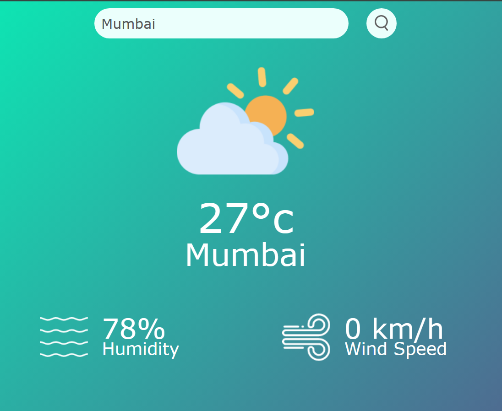

# Weather App

A simple weather application built using JavaScript, HTML, and CSS. This app fetches and displays real-time weather information for any city in the world using a weather API.

## Features

- Search for the current weather by city name
- Displays temperature, humidity, wind speed, and weather conditions
- Dynamic background changes based on weather conditions

## Technologies Used

- **HTML5**: Structure and content of the application
- **CSS3**: Styling the application for a modern and responsive UI
- **JavaScript (ES6)**: Logic and interaction handling
- **OpenWeatherMap API**: Fetching real-time weather data

Usage
 - Enter the name of the city you want to check the weather for in the search bar.
 - Click on the Search button or press Enter.
 - The weather information will be displayed, including:
     - Temperature (in Celsius/Fahrenheit)
     - Humidity percentage
     - Wind speed
     - Weather description (Clear, Rain, Cloudy, etc.)
  
#ScreenShot

  Here is a screenshot of the WeatherApp using JS in action:

  
